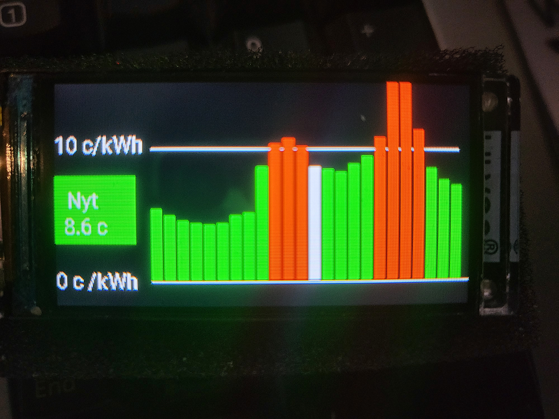
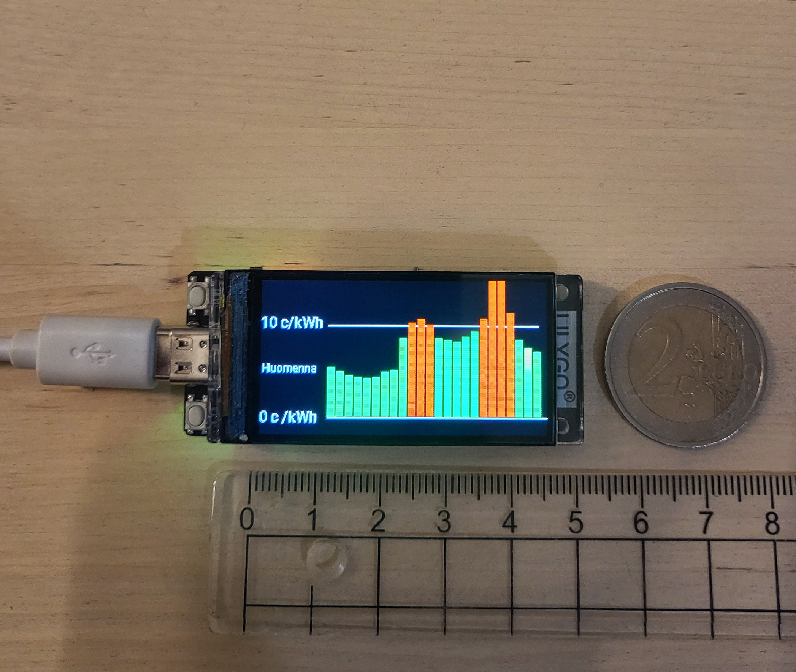

Nordpool viewer
- Designed for 1,9" 170x320 display
- Shows two pages
   *  Today prices and the current price
   *  Next day prices (if available)
   *  Changes pages automatically
- Home assistant pushes price updates

Requirements
* Home Assistant
   * ESPHome https://esphome.io/guides/getting_started_hassio
   * Nordpool https://github.com/custom-components/nordpool
* ESP32 Lilygo T-Display-S3 with 170x320 display 1,9" ST7789
	* USB power source (no optimizations done for the battery use)

Steps
1) Setup ESP32 device and use Nordpool_viewer/LilygoNordpoolViewer.yaml as ESP device config
    * You should modify at least "wifi:", "ota:", "api: encryption:" sections
2) Add an automation to your home assistant. It will update (push) the prices to your ESP32 device
   * Use Nordpool_viewer/automate.yaml as a reference

Known issues
* ESP may occasionally reboot on bad wifi conditions

